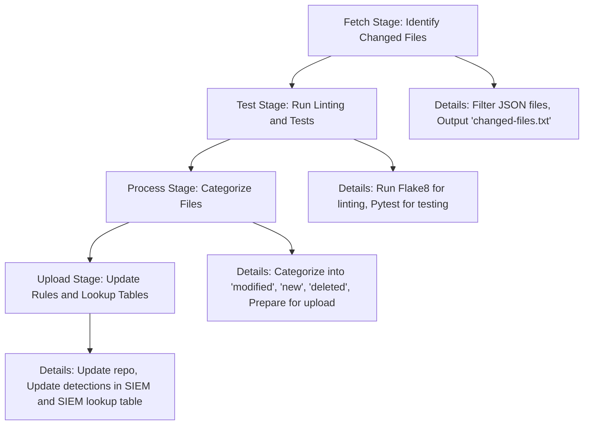

_This blog post is the second post in a series about GitLab Universal Automated Response and Detection (GUARD)._

Writing and deploying security threat detections in an organization’s security information event management platform (SIEM) is a critical component of a successful cybersecurity program. Moving from manual detection engineering to a fully automated process by implementing Detections as Code (DaC) ensures detection consistency, quality, auditing, and automated testing. At GitLab, we’ve embedded DaC capabilities into GUARD, our fully automated detection and response framework.

## The problem: Source control and automated tests

The Signals Engineering and SIRT team at GitLab share the responsibility to create, update, and decommission threat detections in our SIEM. Maintaining a single source of truth for detections is critical to ensure detection consistency and quality standards are met. Our teams made the conscious decision to abstract the detection creation process from our SIEM, improving our issue tracking, consistency, roll-back process, and metrics. Additionally, conducting pre-commit detection tests outside of our SIEM ensured that newly created detections didn’t introduce overly false positive heavy alerts, which would require tuning or disablement while the alert was fixed.

## The Solution: Leverage GitLab CI/CD for detection testing and validation

To address these challenges, we developed an efficient workflow using GitLab CI/CD, resulting in a streamlined and secure SIEM detection deployment process.

### Key components of the GUARD DaC pipeline

**1\. Detections stored in JSON format in a GitLab project**

GitLab uses the JSON format for our threat detections. The template includes essential information such as SIEM query logic, detection title, and description along with runbook page link, MITRE tactic and technique related to the detection, and other necessary details.

**2\. Initiating merge requests**

When a GitLab team member intends to create a new threat detection, update an existing one, or delete a current detection, they initiate the process by submitting a merge request (MR) in the DaC project containing the detection JSON template. Creating the MR automatically triggers a CI/CD pipeline.

**3\. Automated validation with CI/CD jobs**

Each MR contains a number of automated checks via GitLab CI/CD:

- Query format validation queries SIEM API to ensure detection query is valid
- JSON Detection fields validation validates all required fields are present, and are in the correct format
- New detections and detection modification trigger a number of SIEM API calls to ensure the detection does not have any errors and that no issues will be introduced into our production detection rules
- Detection deletion MRs trigger the pipeline to issue a SIEM API query to ensure the detection to be deleted is still active and can be deleted

**4\. Peer review and approval**

When a detection MR job completes successfully, a peer review is required to review and confirm the MR meets required quality and content standards before the detection MR can be merged. Merge request approval rules are used to trigger the peer review process.

**5\. Merge and final deployment**

After the MR is approved, it is merged into the main branch. As part of the CI/CD pipeline, an automated job executes a SIEM API command in order to perform two tasks:

- Create the new detection or update/delete the existing detection if needed.
- Extract the MITRE ATT&CK tactic and technique information related to the alert from the JSON files and transmit these details to a lookup table within the SIEM. This lookup table plays an important role in mapping our alerts to MITRE tactics and techniques, helping us improve our threat analysis and identify gaps in our detection capabilities in alignment with the MITRE framework.

**Note:** The necessary credentials for these actions are securely stored in CI/CD variables to ensure the process remains confidential and secure.

Below is a template GitLab CI/CD `gitlab-ci.yml` configuration file for a DaC pipeline:

```

# --------------------------------------------------------------------------- #
# GitLab CI/CD Pipeline for SIEM Detection Management
# --------------------------------------------------------------------------- #

image: python:3.12

# --------------------------------------------------------------------------- #
# Global Configuration
# --------------------------------------------------------------------------- #

before_script:
  - apt-get update && apt-get install -y jq
  - pip install --upgrade pip
  - pip install -r requirements.txt

# --------------------------------------------------------------------------- #

stages:
  - fetch
  - test
  - process
  - upload

# --------------------------------------------------------------------------- #
# Fetch Stage
# --------------------------------------------------------------------------- #

fetch_changed_files:
  stage: fetch
  Script:
    - echo "Fetching changed files..."
    - git branch
    - git fetch origin $CI_DEFAULT_BRANCH:$CI_DEFAULT_BRANCH --depth 2000
    - |
      if [[ "$CI_COMMIT_BRANCH" == "$CI_DEFAULT_BRANCH" ]]; then
        git diff --name-status HEAD^1...HEAD > changed-files-temp.txt
      else
        git fetch origin $CI_COMMIT_BRANCH:$CI_COMMIT_BRANCH --depth 2000
        git diff --name-status ${CI_DEFAULT_BRANCH}...${CI_COMMIT_SHA} > changed-files-temp.txt
      fi
    - grep -E '.json$' changed-files-temp.txt > changed-files.txt || true
    - flake8 .
    - pytest
  artifacts:
    paths:
      - changed-files.txt
    expose_as: 'changed_files'

# --------------------------------------------------------------------------- #
# Test Stage
# --------------------------------------------------------------------------- #

flake8:
  stage: test
  script:
    - echo "Running Flake8 for linting..."
    - flake8 .

pytest:
  stage: test
  script:
    - echo "Running Pytest for unit tests..."
    - pytest
  artifacts:
    when: always
    reports:
      junit: report.xml

# --------------------------------------------------------------------------- #
# Process Stage
# --------------------------------------------------------------------------- #

process_files:
  stage: process
  script:
    - echo "Processing changed files..."
    - git clone --depth 2000 --branch $CI_DEFAULT_BRANCH $CI_REPOSITORY_URL
    - mkdir -p modified_rules delete_file new_file
    - python3 move-files.py -x changed-files.txt
    - python3 check-alerts-format.py
  artifacts:
    paths:
      - modified_rules
      - delete_file
      - new_file
# --------------------------------------------------------------------------- #
# Upload Stage
# --------------------------------------------------------------------------- #

update_rules:
  stage: upload
  script:
    - echo "Uploading updated rules and lookup tables..."
    - git fetch origin $CI_DEFAULT_BRANCH:$CI_DEFAULT_BRANCH --depth 2000
    - git clone --depth 2000 --branch $CI_DEFAULT_BRANCH $CI_REPOSITORY_URL 
    - python3 update-rules.py
    - python3 update-exceptions.py
    - python3 create_ttps_layers.py
  rules:
    - if: $CI_COMMIT_BRANCH == "main" && $CI_PIPELINE_SOURCE != "schedule"
      changes:
        - detections/**/*
        - exceptions/**/*
```

The diagram below illustrates the workflow of the CI/CD process described above.



## Benefits and outcomes

Automating our detections lifecycle through a DaC CI/CD-powered workflow introduces numerous benefits to our threat detection deployment process:

- Automation: Automating the creation and validation of SIEM detections reduces manual errors and saves time.
- Enhanced security: The CI-driven workflow enforces a "least privilege" policy, ensuring consistency, peer reviews, and quality standards for creating, updating, or deleting threat detections.
- Efficiency: The standardized JSON detection format and automated creation expedite the deployment process.
- Collaboration: The MR and review process fosters collaboration and knowledge sharing among GitLab team members.
- Version control: Treating threat detection as code abstracts the detections from the SIEM platform they are ultimately stored in. This abstraction provides a historical record of changes, facilitates collaboration, and enables rollbacks to previous configurations if issues arise.

## Get started with DaC

Using GitLab CI/CD and a "least privilege" policy has made our SIEM detection and alert management easier and more secure. Automation has improved efficiency and reduced risks, providing a helpful example for others wanting to improve their security and compliance. You can try this tutorial by signing up for a free 60-day trial of GitLab Ultimate.

_This blog post is the second post in a series about GitLab Universal Automated Response and Detection (GUARD)._

Writing and deploying security threat detections in an organization’s security information event management platform (SIEM) is a critical component of a successful cybersecurity program. Moving from manual detection engineering to a fully automated process by implementing Detections as Code (DaC) ensures detection consistency, quality, auditing, and automated testing. At GitLab, we’ve embedded DaC capabilities into GUARD, our fully automated detection and response framework.

## The problem: Source control and automated tests

The Signals Engineering and SIRT team at GitLab share the responsibility to create, update, and decommission threat detections in our SIEM. Maintaining a single source of truth for detections is critical to ensure detection consistency and quality standards are met. Our teams made the conscious decision to abstract the detection creation process from our SIEM, improving our issue tracking, consistency, roll-back process, and metrics. Additionally, conducting pre-commit detection tests outside of our SIEM ensured that newly created detections didn’t introduce overly false positive heavy alerts, which would require tuning or disablement while the alert was fixed.

## The Solution: Leverage GitLab CI/CD for detection testing and validation

To address these challenges, we developed an efficient workflow using GitLab CI/CD, resulting in a streamlined and secure SIEM detection deployment process.

### Key components of the GUARD DaC pipeline

**1\. Detections stored in JSON format in a GitLab project**

GitLab uses the JSON format for our threat detections. The template includes essential information such as SIEM query logic, detection title, and description along with runbook page link, MITRE tactic and technique related to the detection, and other necessary details.

**2\. Initiating merge requests**

When a GitLab team member intends to create a new threat detection, update an existing one, or delete a current detection, they initiate the process by submitting a merge request (MR) in the DaC project containing the detection JSON template. Creating the MR automatically triggers a CI/CD pipeline.

**3\. Automated validation with CI/CD jobs**

Each MR contains a number of automated checks via GitLab CI/CD:

- Query format validation queries SIEM API to ensure detection query is valid
- JSON Detection fields validation validates all required fields are present, and are in the correct format
- New detections and detection modification trigger a number of SIEM API calls to ensure the detection does not have any errors and that no issues will be introduced into our production detection rules
- Detection deletion MRs trigger the pipeline to issue a SIEM API query to ensure the detection to be deleted is still active and can be deleted

**4\. Peer review and approval**

When a detection MR job completes successfully, a peer review is required to review and confirm the MR meets required quality and content standards before the detection MR can be merged. Merge request approval rules are used to trigger the peer review process.

**5\. Merge and final deployment**

After the MR is approved, it is merged into the main branch. As part of the CI/CD pipeline, an automated job executes a SIEM API command in order to perform two tasks:

- Create the new detection or update/delete the existing detection if needed.
- Extract the MITRE ATT&CK tactic and technique information related to the alert from the JSON files and transmit these details to a lookup table within the SIEM. This lookup table plays an important role in mapping our alerts to MITRE tactics and techniques, helping us improve our threat analysis and identify gaps in our detection capabilities in alignment with the MITRE framework.

**Note:** The necessary credentials for these actions are securely stored in CI/CD variables to ensure the process remains confidential and secure.

Below is a template GitLab CI/CD `gitlab-ci.yml` configuration file for a DaC pipeline:

```

# --------------------------------------------------------------------------- #
# GitLab CI/CD Pipeline for SIEM Detection Management
# --------------------------------------------------------------------------- #

image: python:3.12

# --------------------------------------------------------------------------- #
# Global Configuration
# --------------------------------------------------------------------------- #

before_script:
  - apt-get update && apt-get install -y jq
  - pip install --upgrade pip
  - pip install -r requirements.txt

# --------------------------------------------------------------------------- #

stages:
  - fetch
  - test
  - process
  - upload

# --------------------------------------------------------------------------- #
# Fetch Stage
# --------------------------------------------------------------------------- #

fetch_changed_files:
  stage: fetch
  Script:
    - echo "Fetching changed files..."
    - git branch
    - git fetch origin $CI_DEFAULT_BRANCH:$CI_DEFAULT_BRANCH --depth 2000
    - |
      if [[ "$CI_COMMIT_BRANCH" == "$CI_DEFAULT_BRANCH" ]]; then
        git diff --name-status HEAD^1...HEAD > changed-files-temp.txt
      else
        git fetch origin $CI_COMMIT_BRANCH:$CI_COMMIT_BRANCH --depth 2000
        git diff --name-status ${CI_DEFAULT_BRANCH}...${CI_COMMIT_SHA} > changed-files-temp.txt
      fi
    - grep -E '.json$' changed-files-temp.txt > changed-files.txt || true
    - flake8 .
    - pytest
  artifacts:
    paths:
      - changed-files.txt
    expose_as: 'changed_files'

# --------------------------------------------------------------------------- #
# Test Stage
# --------------------------------------------------------------------------- #

flake8:
  stage: test
  script:
    - echo "Running Flake8 for linting..."
    - flake8 .

pytest:
  stage: test
  script:
    - echo "Running Pytest for unit tests..."
    - pytest
  artifacts:
    when: always
    reports:
      junit: report.xml

# --------------------------------------------------------------------------- #
# Process Stage
# --------------------------------------------------------------------------- #

process_files:
  stage: process
  script:
    - echo "Processing changed files..."
    - git clone --depth 2000 --branch $CI_DEFAULT_BRANCH $CI_REPOSITORY_URL
    - mkdir -p modified_rules delete_file new_file
    - python3 move-files.py -x changed-files.txt
    - python3 check-alerts-format.py
  artifacts:
    paths:
      - modified_rules
      - delete_file
      - new_file
# --------------------------------------------------------------------------- #
# Upload Stage
# --------------------------------------------------------------------------- #

update_rules:
  stage: upload
  script:
    - echo "Uploading updated rules and lookup tables..."
    - git fetch origin $CI_DEFAULT_BRANCH:$CI_DEFAULT_BRANCH --depth 2000
    - git clone --depth 2000 --branch $CI_DEFAULT_BRANCH $CI_REPOSITORY_URL 
    - python3 update-rules.py
    - python3 update-exceptions.py
    - python3 create_ttps_layers.py
  rules:
    - if: $CI_COMMIT_BRANCH == "main" && $CI_PIPELINE_SOURCE != "schedule"
      changes:
        - detections/**/*
        - exceptions/**/*
```

The diagram below illustrates the workflow of the CI/CD process described above.


## Benefits and outcomes

Automating our detections lifecycle through a DaC CI/CD-powered workflow introduces numerous benefits to our threat detection deployment process:

- Automation: Automating the creation and validation of SIEM detections reduces manual errors and saves time.
- Enhanced security: The CI-driven workflow enforces a "least privilege" policy, ensuring consistency, peer reviews, and quality standards for creating, updating, or deleting threat detections.
- Efficiency: The standardized JSON detection format and automated creation expedite the deployment process.
- Collaboration: The MR and review process fosters collaboration and knowledge sharing among GitLab team members.
- Version control: Treating threat detection as code abstracts the detections from the SIEM platform they are ultimately stored in. This abstraction provides a historical record of changes, facilitates collaboration, and enables rollbacks to previous configurations if issues arise.

## Get started with DaC

Using GitLab CI/CD and a "least privilege" policy has made our SIEM detection and alert management easier and more secure. Automation has improved efficiency and reduced risks, providing a helpful example for others wanting to improve their security and compliance. You can try this tutorial by signing up for a free 60-day trial of GitLab Ultimate.

Go to Source
